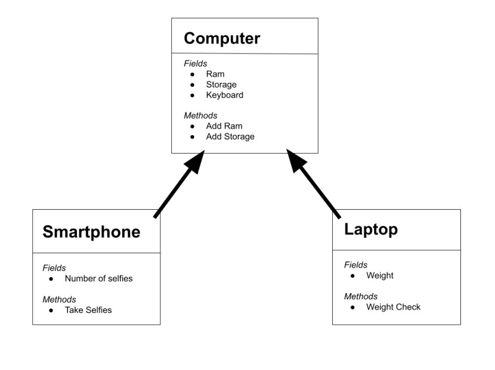

## Task 1

Create three classes : `Computer`, `Laptop`, and `SmartPhone`.   

Создайте три класса: `Компьютер`, `Ноутбук` и `Смартфон`.

3-то класс созед : `Computer`, `Laptop`, and `SmartPhone`.

 Remember to add properties and methods to your diagram.
1. For the parent class `Computer` add:
   - 3 fields
   - 2 methods
   - a constructor

2. For the child class `Laptop` or `SmartPhone`, add at least:
   - 1 additional field
   - 1 additional method

3. The child constructor should send data to the parent class.

##

Не забудьте добавить свойства и методы на диаграмму.
1. Для родительского класса `Компьютер` добавьте:
    - 3 поля
    - 2 метода
    - конструктор

2. Для дочернего класса `Ноутбук` или `Смартфон` добавьте как минимум:
    - 1 дополнительное поле
    - 1 дополнительный метод

3. Дочерний конструктор должен отправлять данные родительскому классу.

##

Дар хотир доред, ки ба диаграммаи худ хосиятҳо(Properties) ва усулҳо(Methods) илова кунед.
1. Барои класси волидайн `Компютер`, илова кунед:
    - 3 майдон
    - 2 усул
    - 1 конструктор

2. Барои класси сhild  `Нутбук` ё `Смартфон` илова кунед:
    - 1 майдони иловагӣ
    - 1 усули иловагӣ

##

### Task 2

1. Create a base class called `Transport`. Inherit from it to create classes called `Car` `Airplane`, and `Train`.                                                
Inherit from the `Car` class to create classes called `PassengerCar` and `CargoCar`.      Inherit from the `Airplane` class to create classes called `CargoPlane` and `PassengerPlane`.                                                 
2. Define properties for the base class and add properties to the derived classes that specifically characterize the objects of the derived classes.

3. Define constructors and methods to populate the properties. Write a method that displays information about the type of transport and its characteristics.

##

1. Создать базовый класс `Транспорт`. От него наследовать `Авто`, `Самолет`, `Поезд`.
От класса `Авто` наследовать классы `Легковое авто`, `Грузовое авто`. От класса `Самолет` наследовать классы `Грузовой самолет` и `Пассажирский самолет`.

2. Придумать свойства для базового класса, а также добавить свойства в дочерние классы, которые будут конкретно характеризовать объекты дочерних классов.

3. Определить конструкторы, методы для заполнения свойств. Написать метод, который выводит информацию о данном виде транспорта и его характеристиках.

##

1. Синфи асосиро бо номи `Нақлиёт` созед. Аз он мерос гиред, то синфҳои бо номи `Мошин`, `Ҳавопаймо` ва `Поезд` созед.
Аз синфи `Car` мерос гиред, то синфҳои бо номи `PassengerCar` ва `CargoCar` эҷод кунед.
Барои сохтани синфҳои бо номи `CargoPlane` ва `PassengerPlane` аз синфи `Airplane` мерос гиред.

3. Хусусиятҳои синфи асосиро муайян кунед ва ба синфҳои ҳосилшуда хосиятҳоеро илова кунед, ки ба таври махсус объектҳои синфҳои ҳосилшударо тавсиф мекунанд.

4. Муайян кардани конструкторҳо ва усулҳои пур кардани хосиятҳо. Усулеро нависед, ки маълумотро дар бораи намуди нақлиёт ва хусусиятҳои он нишон медиҳад."

Удачи с выполнением задания! 📚

